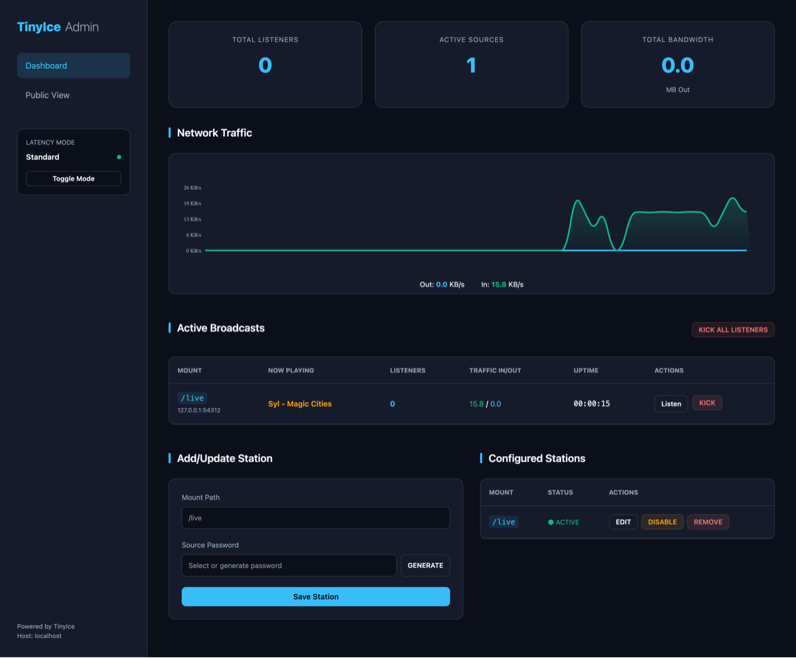
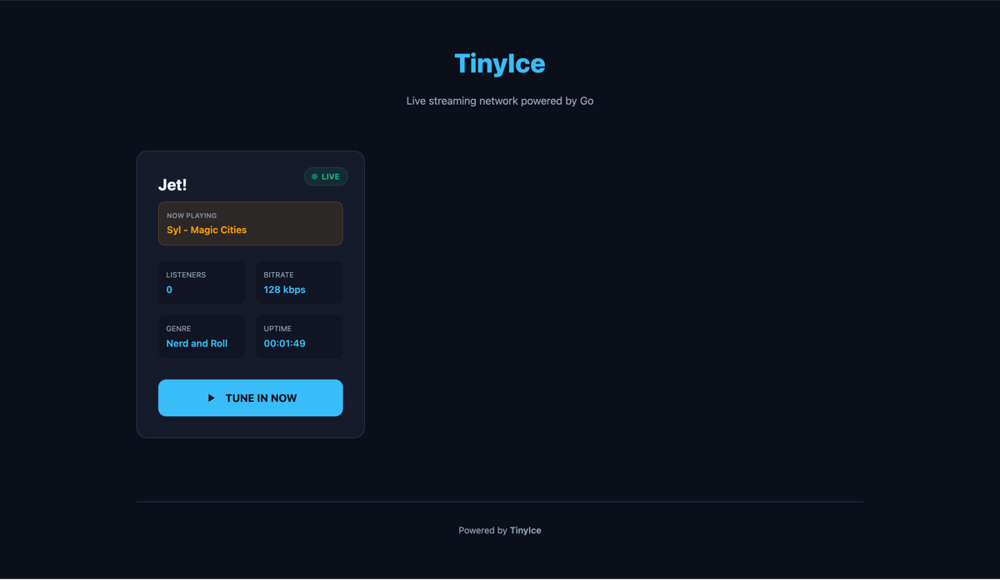

# TinyIce

TinyIce is a lightweight, high-performance, and secure Icecast2-compatible streaming server written in Go. It is designed to be self-contained, easy to deploy, and provides a modern web interface for both administrators and listeners.




[](https://goreportcard.com/report/github.com/DatanoiseTV/tinyice)
[](https://opensource.org/licenses/MIT)

## Why TinyIce?

Traditional streaming servers can be complex to configure and resource-heavy. TinyIce aims to solve this by providing:

-   **Zero Dependencies**: A single binary with all assets including templates and icons embedded at compile time.
-   **Production-Grade Security**: Automatic unique credential generation on the first run, industry-standard **bcrypt** password hashing, built-in CSRF protection, and support for **Automatic HTTPS (ACME/Let's Encrypt)**.
-   **No Default Passwords**: Unique secure credentials are automatically generated on the first run.
-   **Modern UI**: Real-time dashboards powered by Server-Sent Events (SSE) with smooth, hardware-accelerated traffic charts.
-   **Super Low Latency**: A dedicated mode that disables server-side buffering for near-real-time broadcasting.
-   **Advanced Logging**: Structured logging via `logrus` with support for multiple levels (debug, info, warn, error) and formats (text, JSON).

## Features

-   **Icecast2 Compatible**: Fully supports standard source clients such as BUTT, OBS, Mixxx, and LadioCast, as well as players like VLC and modern web browsers.
-   **Dual-Protocol Listening**: Support for HTTPS (Auto or Manual) while maintaining an HTTP listener for legacy source clients that do not support TLS.
-   **UI Customization**: Personalized page titles and subtitles configurable via JSON.
-   **Dynamic Mount Management**: Add, update, disable, or remove mount points through the admin panel without requiring a server restart.
-   **Real-time Analytics**: Visual traffic charts for Inbound and Outbound data flow along with global server statistics (Total Listeners, Active Sources, Bandwidth).
-   **Administrative Controls**: Capability to kick specific streamers, disconnect all listeners, or temporarily disable mount points.
-   **Now Playing Metadata**: Support for industry-standard metadata updates via HTTP query parameters and real-time display on both public and admin pages.
-   **Resource Hardening**: Configured HTTP timeouts and connection limits to protect against common network-level attacks.

## Getting Started

### 1. Build
Requires Go 1.21 or later.
```bash
go build -o tinyice
```

### 2. Run
```bash
./tinyice
```
On the **first run**, TinyIce will:
1.  Generate a secure `tinyice.json` configuration file.
2.  Create unique random passwords for the admin user and the default source.
3.  Display these credentials in your terminal. **Save them immediately as they are stored as salted hashes.**

### 3. Stream
Configure your encoder (e.g., BUTT) to point to:
-   **Server Type**: Icecast 2
-   **Address**: your-server-ip
-   **Port**: 8000
-   **Password**: [The generated source password]
-   **Mount**: /live (or any path you have provisioned)

### 4. Manage
Visit `http://localhost:8000/admin` to manage your stations and view live traffic analytics.

## Command Line Usage

TinyIce supports several flags for operational flexibility:

```bash
./tinyice -log-level debug -json-logs
```

-   `-config`: Path to the configuration file (default: "tinyice.json").
-   `-log-file`: Path to a file for log output (default: stdout).
-   `-log-level`: Logging verbosity: `debug`, `info`, `warn`, `error` (default: "info").
-   `-json-logs`: Enable structured JSON logging for integration with ELK/Loki.

## Configuration

The `tinyice.json` file allows for extensive customization:

```json
{
    "port": "8000",
    "page_title": "My Stream Portal",
    "page_subtitle": "Broadcasting live from Earth",
    "use_https": true,
    "auto_https": true,
    "acme_email": "admin@example.com",
    "domains": ["radio.example.com"],
    "default_source_password": "$2a$12$...",
    "mounts": {
        "/radio1": "$2a$12$..."
    },
    "admin_user": "admin",
    "admin_password": "$2a$12$...",
    "hostname": "localhost",
    "low_latency_mode": false,
    "max_listeners": 100
}
```

## Advanced Usage

### Super Low Latency Mode
Enable this feature in the Admin Panel to disable the "burst-on-connect" buffer. This reduces playback delay from several seconds to less than one second, making it ideal for live interactions.

### Automatic HTTPS (ACME)
TinyIce can automatically manage SSL certificates using Let's Encrypt. Set `auto_https: true`, provide a valid `acme_email`, and list your `domains`. Ensure ports 80 and 443 are reachable.

## License

Distributed under the MIT License. See `LICENSE` for more information.

## Acknowledgements

-   Powered by [Go](https://golang.org)
-   Inspired by the [Icecast](https://icecast.org) project.

---
Developed by [DatanoiseTV](https://github.com/DatanoiseTV)
