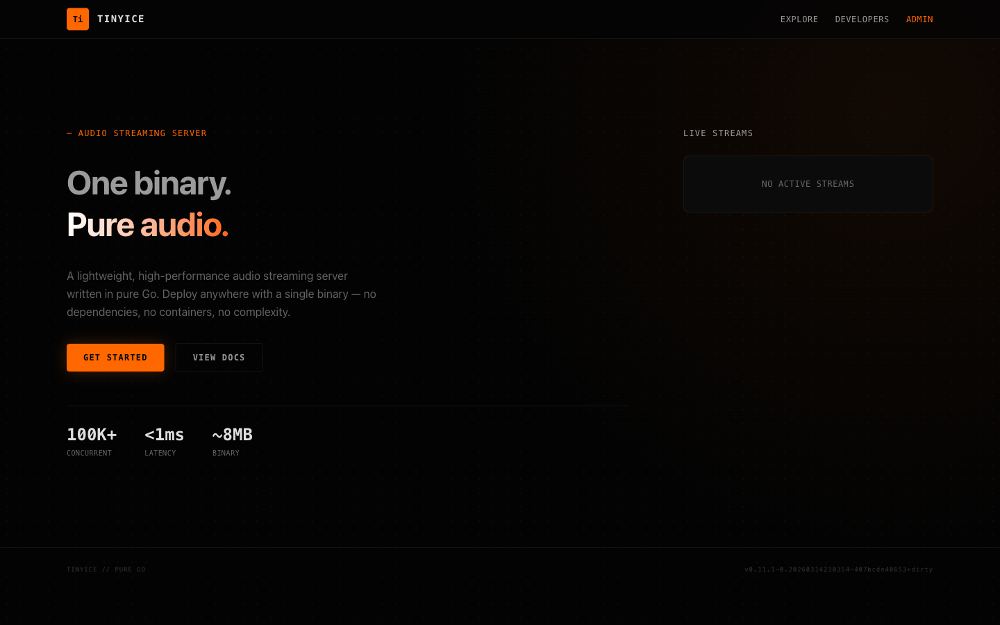
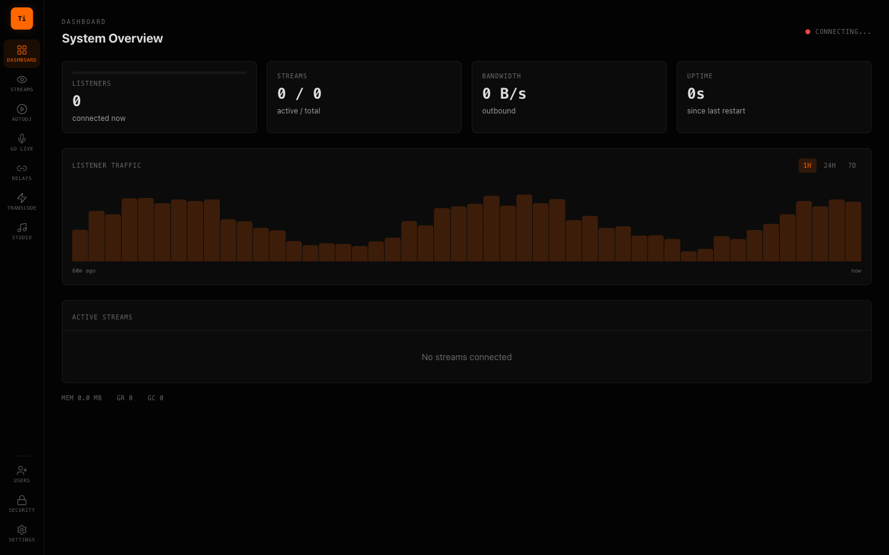
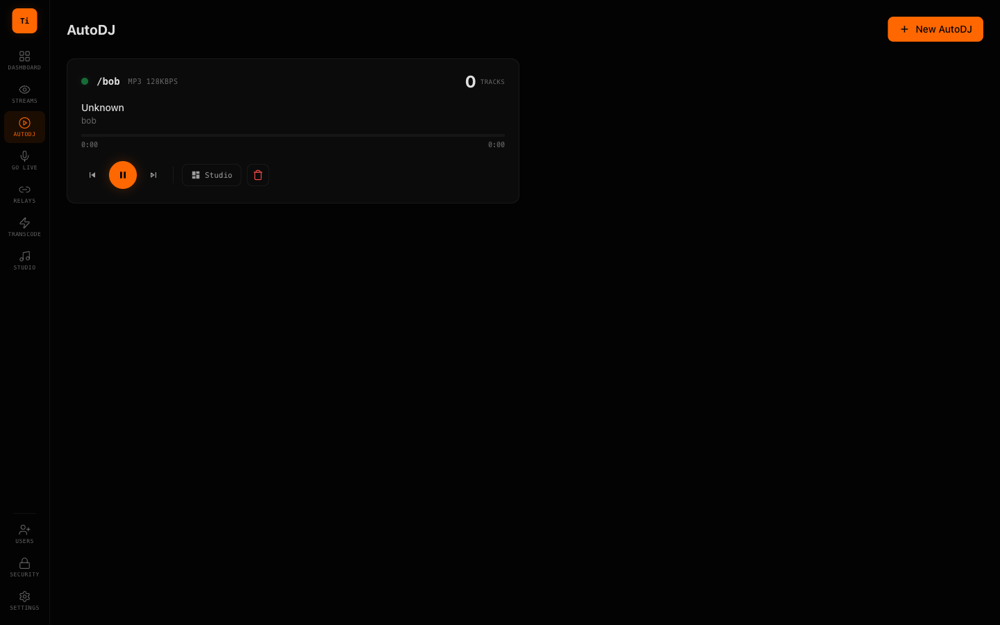
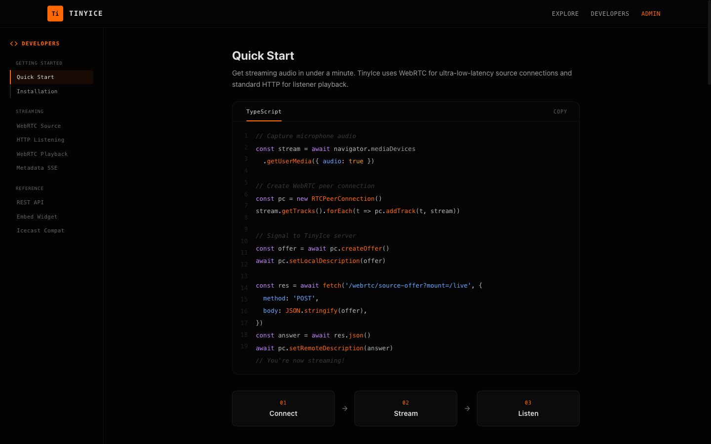

# TinyIce


**One binary. Pure audio.**

> High-performance Icecast-compatible streaming with WebRTC, AutoDJ, transcoding, and a world-class web interface. Deploy anywhere in seconds.

### Landing Page


### Admin Dashboard


### AutoDJ Management


### Developer Portal



[](https://goreportcard.com/report/github.com/DatanoiseTV/tinyice)
[](https://opensource.org/licenses/Apache-2.0)

## What's New in v2.0 Beta

- **Complete Admin UI Rewrite** — Modern single-page app built with Preact, real-time SSE updates, dark theme
- **Bearer Token API Auth** — Create API access tokens for scripts and integrations, with expiry and usage tracking
- **Full Branding System** — Custom site name, tagline, logo upload, accent color picker, Markdown landing page
- **Interactive API Docs** — Built-in Swagger UI at `/api/docs` with complete OpenAPI 3.0 spec
- **WebRTC Go Live** — Broadcast from your browser with audio device selection, spectrum analyzer, level meters with headroom (dB)
- **AutoDJ Studio** — 3-column studio interface with library browser, transport controls, visualizer, playlist editor, and mount selector
- **AutoDJ Editing** — Edit existing AutoDJ instances directly (name, mount, format, bitrate, etc.)
- **Dashboard Improvements** — Split inbound/outbound bandwidth stats, real-time stream health
- **Stream Management** — Configured-but-offline mounts now visible, proper create/delete/kick workflows
- **Relay & Transcoder Management** — Full CRUD with live status indicators
- **Markdown Landing Page** — Full GFM support via `marked` — headings, lists, code blocks, links, images
- **Color Picker** — Visual accent color selection with 10 presets + native OS color picker + hex input
- **Logo Upload** — PNG/JPG/SVG logo served at `/branding/logo`, shown in nav bar
- **No CSRF for API** — JSON API requests no longer need CSRF tokens
- **Makefile + go:generate** — `make build` rebuilds everything; frontend builds automatically via `go generate`
- **Multi-auth** — Session cookies, Bearer tokens, Basic Auth, Passkeys (WebAuthn), OIDC/OAuth2

## Why TinyIce?

Traditional streaming servers can be complex to configure and resource-heavy. TinyIce aims to solve this by providing:

-   **Massive Scalability**: Built with a **Shared Circular Buffer** architecture that allows a single stream to be broadcast to hundreds of thousands of listeners with near-zero memory allocations.
-   **Instant Deployment**: A single binary with all assets (templates, icons, frontend) embedded.
-   **Zero-Config Security**: Unique secure credentials automatically generated on first run.
-   **Multi-Tenant Ready**: Create multiple admin users who can only manage their own mount points.
-   **Edge-Ready Relaying**: Pull streams from other servers with automatic reconnection and in-stream ICY metadata parsing.
-   **Secure & Hardened**: Salted **bcrypt** password hashing, rate limiting, and HTTP resource hardening.
-   **Auto-HTTPS**: Built-in support for **ACME (Let's Encrypt)** for zero-configuration SSL certificates. Supports custom ACME CAs (e.g., Step-CA) for homelab environments.
-   **Real-time Insights**: SSE-powered dashboards with live traffic charts.
-   **Playback History**: Persistent song history stored in a lightweight SQLite database.
-   **Observability**: Built-in **Prometheus** metrics endpoint and structured logging.

## Features

### Streaming & Protocols
-   **Icecast2 Compatible**: Works with standard source clients (BUTT, OBS, Mixxx, LadioCast) and players (VLC, web browsers).
-   **WebRTC Source & Playback**: Ultra-low-latency browser-based broadcasting and listening via the Go Live page.
-   **High-Performance Distribution**: Shared circular buffer architecture designed for 100,000+ concurrent listeners per stream.
-   **Instant Start**: Listeners receive a 64KB audio burst upon connection, eliminating the "buffering" delay.
-   **Built-in Transcoding**: Pure Go transcoding (MP3/Opus) to provide multiple quality options from a single source. No FFmpeg required.
-   **Edge Relaying**: Pull streams from upstream servers with automatic reconnection.
-   **Smart Fallback & Auto-Recovery**: Automatically switch listeners to a backup stream if the primary drops.
-   **Outbound ICY Metadata**: Injects song titles into the audio stream for traditional radio players.
-   **Playlist Support**: `.m3u8`, `.m3u`, and `.pls` playlists for VLC, Winamp, mobile apps.
-   **HLS Output**: Automatic HLS segmentation for each mount point.

### AutoDJ
-   **Multi-Instance Orchestration**: Multiple independent AutoDJs on different mounts from a single server.
-   **Precision Pacing**: Frame-accurate bitstream pacing ensures file-based streams behave exactly like live broadcasts.
-   **Studio Interface**: Full 3-column studio view with library browser, transport controls, visualizer, and playlist management.
-   **Smart Shuffle & Queue**: Priority queue, shuffle mode, loop mode, and drag-to-reorder.
-   **MPD Protocol Support**: Per-instance Music Player Daemon for remote control via standard MPD clients.
-   **Dynamic Metadata**: Automatic ID3 tag extraction and real-time ICY metadata injection.

### Admin Web UI
-   **Modern SPA Dashboard**: Real-time stats (inbound/outbound bandwidth, listeners, streams, system health).
-   **Stream Management**: Create, edit, delete mounts. Kick sources or listeners.
-   **AutoDJ Management**: Create, edit, delete AutoDJ instances with inline editing.
-   **Studio**: Full-featured studio page with mount selector, library browser, playlist editor, and transport controls.
-   **Go Live**: Browser-based WebRTC broadcasting with audio device selection, spectrum analyzer, level meters with headroom display (dB), and peak hold indicators.
-   **Relay & Transcoder Management**: Create and manage relay pulls and live transcoders.
-   **User Management**: Create, edit, delete users with role-based access control.
-   **Security**: IP banning and whitelisting with CIDR support.
-   **Pending Users**: Approve or deny OIDC-authenticated users waiting for access.
-   **Full Branding**: Customize site name, tagline, accent color (with visual picker), logo upload, and landing page content (full Markdown support).
-   **Settings**: Server configuration, HTTPS, directory listing, auto-update toggles.

### API & Developer Experience
-   **REST API**: Full JSON API for all management operations (streams, autodj, relays, transcoders, users, security, branding, settings, stats).
-   **Bearer Token Auth**: Create API access tokens in the admin panel for scripts, CI/CD, and external integrations. Tokens support optional expiry and track last-used time/IP.
-   **Session Auth**: Standard cookie-based session authentication via login form.
-   **No CSRF for API**: JSON API requests are inherently CSRF-safe — no token management needed for API consumers.
-   **Interactive API Docs**: Built-in Swagger UI at `/api/docs` with full OpenAPI 3.0 specification.
-   **OpenAPI Spec**: Downloadable at `/api/openapi.yaml` for code generation and client libraries.
-   **SSE Events**: Real-time Server-Sent Events for metadata changes, stream status, and listener counts.
-   **Embeddable Player**: Minimal iframe-based player for external websites.
-   **Developer Portal**: Built-in documentation page at `/developers` with code examples and endpoint reference.

### Authentication
-   **Username/Password**: Standard login with bcrypt-hashed passwords.
-   **Passkeys (WebAuthn)**: Passwordless authentication with hardware security keys or biometrics.
-   **OIDC/OAuth2**: External identity providers (GitHub, Google, etc.) with pending user approval workflow.
-   **API Tokens**: Bearer tokens for programmatic access with expiry and usage tracking.

### Operations
-   **Zero-Downtime Updates**: `SO_REUSEPORT` support for seamless binary upgrades.
-   **Prometheus Metrics**: `/metrics` endpoint with per-stream and system metrics.
-   **Stream Health Monitoring**: Real-time detection of packet loss and buffer skips.
-   **Structured Logging**: JSON logs with separate auth audit log support.
-   **Auto-Update**: Optional automatic update checking.
-   **`go generate` Build**: `go generate ./server/...` rebuilds the frontend automatically.

## Getting Started

### 1. Install (Pre-built Binary)

```bash
# Download latest release
curl -LJO "https://github.com/DatanoiseTV/tinyice/releases/latest/download/tinyice-$(uname -s | tr '[:upper:]' '[:lower:]')-$(uname -m)"

# Make executable
chmod +x tinyice-*
mv tinyice-* tinyice

# Run
./tinyice
```

### 2. Build from Source

Requires Go 1.21+ and Node.js 18+.

```bash
git clone https://github.com/DatanoiseTV/tinyice.git
cd tinyice

# Full build (frontend + Go binary)
make build

# Or manually:
go generate ./server/...   # Rebuild frontend
go build -o tinyice .
```

### 3. First Run

On first run, TinyIce generates `tinyice.json` and prints secure credentials:

```
  FIRST RUN: SECURE CREDENTIALS GENERATED
  Admin Password:  your_admin_password_here
  Default Source Password: your_source_password_here
  Live Mount Password:   your_livemount_password_here
```

**Save these passwords!** Then open `http://localhost:8000` in your browser.

### 4. Stream

Point your encoder (BUTT, OBS, Mixxx) to:
-   **Server Type**: Icecast 2
-   **Address**: your-server-ip
-   **Port**: 8000
-   **Password**: [The generated source password]
-   **Mount**: /live

Or use the **Go Live** page in the admin panel to broadcast directly from your browser via WebRTC.

## API Usage

### Authentication

Two methods are supported:

**Session cookie** — Log in via the web UI or `POST /login`.

**Bearer token** — Create a token in the admin panel at `/admin/tokens`, then use it in API requests:

```bash
# Create a token in the admin UI, then:
curl -H "Authorization: Bearer ti_your_token_here" http://localhost:8000/api/stats
```

### Example API Calls

```bash
TOKEN="ti_your_token_here"

# List streams
curl -H "Authorization: Bearer $TOKEN" http://localhost:8000/api/streams

# Create a mount
curl -X POST -H "Authorization: Bearer $TOKEN" \
  -H "Content-Type: application/json" \
  -d '{"mount": "/radio", "password": "secret"}' \
  http://localhost:8000/api/streams

# Get server stats
curl -H "Authorization: Bearer $TOKEN" http://localhost:8000/api/stats

# List AutoDJ instances
curl -H "Authorization: Bearer $TOKEN" http://localhost:8000/api/autodj
```

### Interactive API Docs

Visit `/api/docs` for the full Swagger UI, or download the OpenAPI spec at `/api/openapi.yaml`.

## Configuration

TinyIce uses a JSON configuration file (`tinyice.json`):

```json
{
    "bind_host": "0.0.0.0",
    "port": "8000",
    "base_url": "https://radio.example.com",
    "page_title": "My Radio",
    "page_subtitle": "Broadcasting 24/7",
    "accent_color": "#ff6600",
    "max_listeners": 100,
    "directory_listing": true,
    "autodjs": [
        {
            "name": "24/7 Chill",
            "mount": "/chill",
            "music_dir": "/music/chill",
            "format": "mp3",
            "bitrate": 128,
            "enabled": true,
            "loop": true,
            "inject_metadata": true
        }
    ]
}
```

### Auto-HTTPS (Let's Encrypt)

```json
{
    "use_https": true,
    "auto_https": true,
    "port": "80",
    "https_port": "443",
    "domains": ["radio.example.com"],
    "acme_email": "admin@example.com"
}
```

Ports 80/443 required for ACME challenges. On Linux without root:
```bash
sudo setcap 'cap_net_bind_service=+ep' ./tinyice
```

### Branding

Customize the landing page through the admin Settings > Branding tab:
- **Site Name**: Shown in the nav bar and browser tab
- **Tagline**: Shown on the landing page
- **Accent Color**: Primary color with visual picker and presets
- **Logo**: Upload PNG/JPG/SVG (served at `/branding/logo`)
- **Landing Content**: Full Markdown support for the hero section

When branding is customized, the default TinyIce marketing content is replaced with your content.

## Monitoring & Observability

TinyIce provides built-in Prometheus metrics at `/metrics` (requires Basic Auth):

- **Listeners**: Total and per-mount counts
- **Throughput**: Bytes in/out per stream
- **System**: Memory usage, goroutines, GC stats, uptime

### Grafana Dashboard

Example configurations in the repository:
- [monitoring/grafana-dashboard.json](monitoring/grafana-dashboard.json)
- [monitoring/prometheus.yml](monitoring/prometheus.yml)

## Command Line Usage

```bash
./tinyice [options]
```

| Flag | Default | Description |
|------|---------|-------------|
| `-host` | `0.0.0.0` | Network interface to bind to |
| `-port` | `8000` | HTTP/Icecast port |
| `-https-port` | `443` | HTTPS port |
| `-use-https` | `false` | Enable HTTPS |
| `-auto-https` | `false` | Automatic SSL via Let's Encrypt |
| `-domains` | | Comma-separated domains for SSL |
| `-config` | `tinyice.json` | Config file path |
| `-log-file` | | Log output file |
| `-auth-log-file` | | Separate auth audit log |
| `-log-level` | `info` | `debug`, `info`, `warn`, `error` |
| `-json-logs` | `false` | Structured JSON logging |
| `-daemon` | `false` | Run in background |
| `-pid-file` | | PID file path |

## Makefile

```bash
make build     # Full build: frontend + Go binary
make generate  # Rebuild frontend only (go generate)
make quick     # Go-only build (skip frontend)
make dev       # Run frontend dev server
make clean     # Remove build artifacts
```

## Embedding the Player

```html
<iframe
    src="https://your-server.com/embed/live"
    width="100%"
    height="80"
    frameborder="0"
    allow="autoplay"
></iframe>
```

## Performance

See [PERFORMANCE.md](PERFORMANCE.md) for detailed hardware and traffic estimates.

## Contributing

Contributions are welcome! Please see [DEVELOPERS.md](DEVELOPERS.md) for an architectural overview and onboarding guide.

## License

Distributed under the Apache License 2.0. See `LICENSE` for more information.

---
Developed by [DatanoiseTV](https://github.com/DatanoiseTV)
